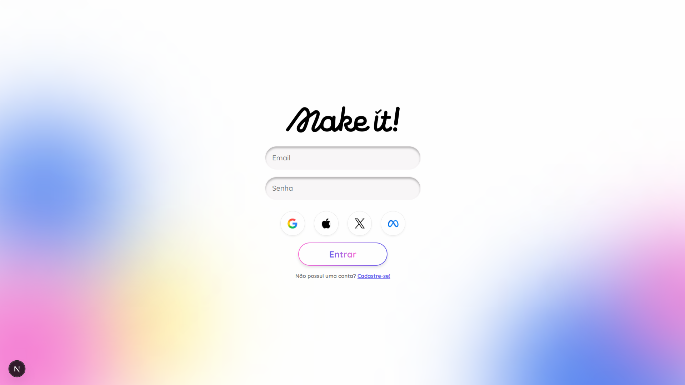

Make it!

🗓️O Make it! é uma aplicação moderna de gerenciamento de tarefas desenvolvida para oferecer uma interface limpa, intuitiva e esteticamente agradável. O foco principal deste projeto é a união entre uma lógica de front-end sólida e um design de alta fidelidade.

✨ Funcionalidades
Validação em Tempo Real: Tratamento de erros dinâmico para campos de nome, email e senhas.  
Segurança no Cadastro: Lógica de verificação para confirmação de senhas idênticas.  
Feedback de UX: Botões com estados de carregamento (loading) e bloqueio de cliques duplos durante o envio.
Interface Moderna: Backgrounds dinâmicos utilizando formas com desfoque (Blur Blobs) e bordas com gradiente CSS avançado.  
Navegação SPA: Transições de página instantâneas utilizando o componente Link do Next.js.

🛠️ Tecnologias Utilizadas
React / Next.js: Estrutura principal da aplicação.  
Styled Components: Estilização baseada em componentes e propriedades dinâmicas.  
TypeScript: Garantia de tipagem e segurança no desenvolvimento.  

👥 Equipe de Desenvolvimento Este projeto é fruto de um esforço colaborativo entre:
Augusto Cesar
Arthur Vinícius
Carlos Joab
Elton Silva Sobral
Hian Henrique
Michael Domingos
